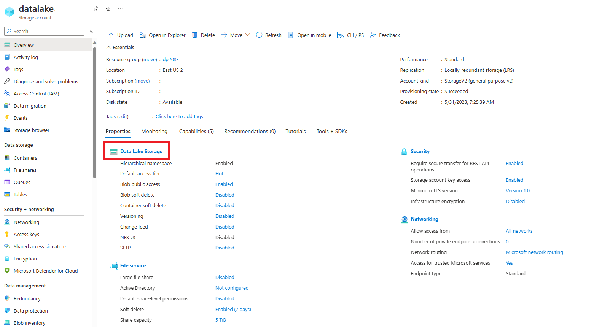

---
lab:
  title: Lake データベース内のデータを分析する
  ilt-use: Suggested demo
---

# Lake データベース内のデータを分析する

Azure Synapse Analytics を使用すると、データ レイク内のファイル ストレージの柔軟性と、"Lake データベース" を作成する機能を通じてリレーショナル データベースの構造化スキーマと SQL クエリの機能を組み合わせることができます。** Lake データベースは、データ レイク ファイル ストアで定義されたリレーショナル データベース スキーマであり、データ ストレージをクエリに使用するコンピューティングから分離できます。 Lake データベースには、通常はリレーショナル データベース システムでのみ使用できるデータ型、リレーションシップ、およびその他の機能のサポートを含む構造化スキーマのベネフィットと、リレーショナル データベース ストアとは別に使用できるデータをファイルに格納できる柔軟性が組み合わされています。 基本的に、Lake データベースはリレーショナル スキーマをデータ レイク内のフォルダー内のファイルに "オーバーレイ" します。

この演習の所要時間は約 **45** 分です。

## 開始する前に

管理レベルのアクセス権を持つ [Azure サブスクリプション](https://azure.microsoft.com/free)が必要です。

## Azure Synapse Analytics ワークスペースをプロビジョニングする

Lake データベースをサポートするには、データ レイク ストレージにアクセスできる Azure Synapse Analytics ワークスペースが必要です。 組み込みのサーバーレス SQL プールを使用して Lake データベースを定義できるため、専用 SQL プールは必要ありません。 必要に応じて、Spark プールを使用して Lake データベース内のデータを操作することもできます。

この演習では、Azure Synapse Analytics ワークスペースをプロビジョニングするために、PowerShell スクリプトと ARM テンプレートを組み合わせて使用します。

1. [Azure portal](https://portal.azure.com) (`https://portal.azure.com`) にサインインします。
2. ページ上部の検索バーの右側にある **[\>_]** ボタンを使用して、Azure portal に新しい Cloud Shell を作成します。メッセージが表示された場合は、***PowerShell*** 環境を選択して、ストレージを作成します。 次に示すように、Azure portal の下部にあるペインに、Cloud Shell のコマンド ライン インターフェイスが表示されます。

    

    > **注**:前に *Bash* 環境を使ってクラウド シェルを作成した場合は、そのクラウド シェル ペインの左上にあるドロップダウン メニューを使って、***PowerShell*** に変更します。

3. ペインの上部にある区分線をドラッグして Cloud Shell のサイズを変更したり、ペインの右上にある **&#8212;** 、 **&#9723;** 、**X** アイコンを使用して、ペインを最小化または最大化したり、閉じたりすることができます。 Azure Cloud Shell の使い方について詳しくは、[Azure Cloud Shell のドキュメント](https://docs.microsoft.com/azure/cloud-shell/overview)をご覧ください。

4. PowerShell のペインで、次のコマンドを入力して、リポジトリを複製します。

    ```
    rm -r dp-203 -f
    git clone https://github.com/MicrosoftLearning/dp-203-azure-data-engineer dp-203
    ```

5. リポジトリがクローンされたら、次のコマンドを入力してこの演習用のフォルダーに移動し、そこに含まれている **setup.ps1** スクリプトを実行します。

    ```
    cd dp-203/Allfiles/labs/04
    ./setup.ps1
    ```

6. メッセージが表示された場合は、使用するサブスクリプションを選択します (これは、複数の Azure サブスクリプションへのアクセス権を持っている場合にのみ行います)。
7. メッセージが表示されたら、Azure Synapse SQL プールに設定する適切なパスワードを入力します。

    > **注**: このパスワードは忘れないようにしてください。

8. スクリプトの完了まで待ちます。通常、約 10 分かかりますが、さらに時間がかかる場合もあります。 待っている間に、Azure Synapse Analytics ドキュメントの「[Lake データベース](https://docs.microsoft.com/azure/synapse-analytics/database-designer/concepts-lake-database)」と「[Lake データベース テンプレート](https://docs.microsoft.com/azure/synapse-analytics/database-designer/concepts-database-templates)」の記事を確認してください。

## コンテナーのアクセス許可を変更する

1. デプロイ スクリプトが完了したら、Azure portal で、作成された **dp203-*xxxxxxx*** リソース グループに移動し、このリソース グループに Synapse ワークスペース、データ レイク用のストレージ アカウント、Apache Spark プールが含まれていることを確認します。
1. **datalakexxxxxxx** という名前のデータ レイクの **[ストレージ アカウント]** を選択します 

     

1. **datalakexxxxxx** コンテナー内で、**files フォルダー**を選択します

    

1. **files フォルダー**内に、**[アクセス キー (Entra ユーザー アカウントに切り替え)]** として **[認証方法:]** が一覧表示されます。これをクリックして Entra ユーザー アカウントに変更します。******

    
## Lake データベースを作成する

Lake データベースは、ワークスペースで定義し、組み込みのサーバーレス SQL プールを使用して操作できるデータベースの一種です。

1. Synapse ワークスペースを選び、その **[概要]** ページの **[Synapse Studio を開く]** カードで **[開く]** を選んで、新しいブラウザー タブで Synapse Studio を開きます。メッセージが表示されたらサインインします。
2. Synapse Studio の左側にある **&rsaquo;&rsaquo;** アイコンを使用してメニューを展開します。これにより、リソースの管理とデータ分析タスクの実行に使用するさまざまなページが Synapse Studio 内に表示されます。
3. **[データ]** ページで **[リンク]** タブを表示して、Azure Data Lake Storage Gen2 ストレージ アカウントへのリンクがワークスペースに含まれていることを確認します。
4. **[データ]** ページの **[ワークスペース]** タブに戻り、ワークスペースにデータベースがないことを確認してください。
5. **+** メニューで **[Lake データベース]** を選択して、データベース スキーマを設計できる新しいタブを開きます (ダイアログが表示されたら、データベース テンプレートの使用条件を受け入れます)。
6. 新しいデータベースの **[プロパティ]** ペインで、 **[名前]** を **[RetailDB]** に変更し、 **[Input folder]** プロパティが **[files/RetailDB]** に自動的に更新されることを確認します。 **[データ形式]** は **[区切りテキスト]** のままにします ( *[Parquet]* 形式を使用することもできます。個々のテーブルのファイル形式をオーバーライドすることもできます。この演習では、コンマ区切りのデータを使用します)。
7. **[RetailDB]** ペインの上部にある **[発行]** を選択して、ここまでのデータベースを保存します。
8. 左側の **[データ]** ペインで、 **[リンク]** タブを表示します。次に、 **[Azure Data Lake Storage Gen2]** を展開し、**synapse*xxxxxxx*** ワークスペースにプライマリ **datalake*xxxxxxx*** ストアを選択し、 **[files]** ファイル システムを選択します。現時点では **[synapse]** という名前のフォルダーが含まれています。
9.  **[files]** タブが開いたら、 **[+ 新しいフォルダー]** ボタンを使用して **[RetailDB]** という名前の新しいフォルダーを作成します。これがデータベースのテーブルで使用されるデータ ファイルの入力フォルダーになります。

## テーブルを作成する

これで Lake データベースが作成されたので、テーブルを作成してスキーマを定義できます。

### テーブル スキーマを定義する

1. データベース定義の **[RetailDB]** タブに戻り、 **[+ テーブル]** の一覧で **[カスタム]** を選択し、 **[Table_1]** という名前の新しいテーブルがデータベースに追加されることを確認してください。
2. **[Table_1]** を選択した状態で、データベース デザイン キャンバスの **[全般]** タブの **[Name]** プロパティを **[Customer]** に変更します。
3. **[テーブルのストレージ設定]** セクションを展開し、テーブルが区切りテキストとして Synapse ワークスペースの既定のデータ レイク ストアの **[files/RetailDB/Customer]** フォルダーに格納されることを確認してください。
4. **[列]** タブで、テーブルに既定で **[Column_1]** という名前の列が 1 つ含まれていることを確認してください。 次のプロパティと一致するように列定義を編集します。

    | Name | [キー] | 説明 | NULL 値の許容 | データ型 | 形式と長さ |
    | ---- | ---- | ----------- | ----------- | --------- | --------------- |
    | CustomerId | PK &#128505; | 一意の顧客 ID | &#128454;  | long | |

5. **[+ 列]** の一覧で **[新しい列]** を選択し、次のように新しい列定義を変更して **[FirstName]** 列をテーブルに追加します。

    | Name | [キー] | 説明 | NULL 値の許容 | データ型 | 形式と長さ |
    | ---- | ---- | ----------- | ----------- | --------- | --------------- |
    | CustomerId | PK &#128505; | 一意の顧客 ID | &#128454;  | long | |
    | **FirstName** | **PK &#128454;** | **顧客の名** | **&#128454;** | **string** | **256** |

6. テーブル定義が次のようになるまで、新しい列を追加します。

    | Name | [キー] | 説明 | NULL 値の許容 | データ型 | 形式と長さ |
    | ---- | ---- | ----------- | ----------- | --------- | --------------- |
    | CustomerId | PK &#128505; | 一意の顧客 ID | &#128454;  | long | |
    | FirstName | PK &#128454; | 顧客のファースト ネーム | &#128454; | string | 256 |
    | LastName | PK &#128454; | 顧客の名字 | &#128505; | string | 256 |
    | EmailAddress | PK &#128454; | 顧客のメール アドレス | &#128454; | string | 256 |
    | 電話番号 | PK &#128454; | 顧客の電話番号 | &#128505; | string | 256 |

7. すべての列を追加したら、もう一度データベースを発行して変更を保存します。
8. 左側の **[データ]** ペインで、 **[ワークスペース]** タブに戻ると、 **[RetailDB]** Lake データベースを表示できます。 次に、それを展開し、その **[テーブル]** フォルダーを更新して、新しく作成された **[Customer]** テーブルを表示します。

### テーブルのストレージ パスにデータを読み込む

1. メイン ペインで、 **[files]** タブに戻ります。ここには、 **[RetailDB]** フォルダーを含むファイル システムが含まれています。 次に **[RetailDB]** フォルダーを開き、 **[Customer]** という名前の新しいフォルダーを作成します。 ここで、 **[Customer]** テーブルがデータを取得します。
2. 新しい **[Customer]** フォルダーを開きます。これは空のはずです。
3. **customer.csv** データ ファイルを [https://raw.githubusercontent.com/MicrosoftLearning/dp-203-azure-data-engineer/master/Allfiles/labs/04/data/customer.csv](https://raw.githubusercontent.com/MicrosoftLearning/dp-203-azure-data-engineer/master/Allfiles/labs/04/data/customer.csv) からダウンロードし、ローカル コンピューターのフォルダーに保存します (場所はどこでもかまいません)。 次に、Synapse Explorer の **[Customer]** フォルダーで、 **&#10514; [アップロード]** ボタンを使用して **[customer.csv]** ファイルをデータ レイクの **[RetailDB/Customer]** フォルダーにアップロードします。

    > **注**: 実際の運用シナリオでは、テーブル データのフォルダーにデータを取り込むパイプラインを作成する可能性があります。 この演習では、Synapse Studio ユーザー インターフェイスに直接アップロードします。

4. 左側の **[データ]** ペインの **[ワークスペース]** タブの **[Customer]** テーブルの **[...]** メニューで、 **[新しい SQL スクリプト]**  >  **[上位 100 行を選択]** を選択します。 次に、新しい **[SQL スクリプト 1]** ペインが開いたら、**組み込みの** SQL プールが接続されていることを確認し、 **&#9655; [実行]** ボタンを使用して SQL コードを実行します。 結果には、データ レイクの基になるフォルダーの格納データに基づいて、 **[Customer]** テーブルの最初の 100 行が含まれているはずです。
5. **[SQL スクリプト 1]** タブを閉じ、変更を破棄します。

## データベース テンプレートからテーブルを作成する

ご覧のように、Lake データベースに必要なテーブルは最初から作成することができます。 しかし、Azure Synapse Analytics には、データベース スキーマの開始点として使用できる一般的なデータベース ワークロードとエンティティに基づく多数のデータベース テンプレートも用意されています。

### テーブル スキーマを定義する

1. メイン ペインで、データベース スキーマ (現在は **[Customer]** テーブルのみを含む) を含む **[RetailDB]** ペインに戻ります。
2. **[+ テーブル]** メニューで **[テンプレートから]** を選択します。 次に、 **[テンプレートから追加する]** ページで **[Retail]** を選択し、 **[続行]** をクリックします。
3. **[テンプレート (Retail) から追加する]** ページで、テーブルの一覧が設定されるまで待ってから、 **[Product]** を展開し、 **[RetailProduct]** を選択します。 **[追加]** をクリックします。 これにより、 **[RetailProduct]** テンプレートに基づく新しいテーブルがデータベースに追加されます。
4. **[RetailDB]** ペインで、新しい **[RetailProduct]** テーブルを選択します。 次に、デザイン キャンバスの下のペインの **[全般]** タブで、名前を **[Product]** に変更し、テーブルのストレージ設定で入力フォルダー **[files/RetailDB/Product]** が指定されていることを確認します。
5. **[Product]** テーブルの **[列]** タブで、テンプレートから継承された多数の列がテーブルに既に含まれていることを確認してください。 このテーブルには必要以上の列が含まれるので、いくつか削除する必要があります。
6. **[Name]** の横にあるチェックボックスをオンにしてすべての列を選択し、次の列 (保持する必要がある列) を選択<u>解除</u>します。
    - ProductId
    - ProductName
    - IntroductionDate
    - ActualAbandonmentDate
    - ProductGrossWeight
    - ItemSku
7. **[列]** ペインのツール バーで、 **[削除]** を選択して選択した列を削除します。 これにより、次の列が残るはずです。

    | Name | [キー] | 説明 | NULL 値の許容 | データ型 | 形式と長さ |
    | ---- | ---- | ----------- | ----------- | --------- | --------------- |
    | ProductId | PK &#128505; | 製品の一意の識別子。 | &#128454;  | long | |
    | ProductName | PK &#128454; | 製品の名前... | &#128505; | string | 128 |
    | IntroductionDate | PK &#128454; | 製品の販売が採用された日付。 | &#128505; | date | YYYY-MM-DD |
    | ActualAbandonmentDate | PK &#128454; | 製品のマーケティングが実際に中止された日付... | &#128505; | date | YYY-MM-DD |
    | ProductGrossWeight | PK &#128454; | 製品の総重量。 | &#128505; | decimal | 18、8 |
    | ItemSku | PK &#128454; | 在庫保管単位の識別子... | &#128505; | string | 20 |

8. 次に示すように、 **[ListPrice]** という名前の新しい列をテーブルに追加します。

    | Name | [キー] | 説明 | NULL 値の許容 | データ型 | 形式と長さ |
    | ---- | ---- | ----------- | ----------- | --------- | --------------- |
    | ProductId | PK &#128505; | 製品の一意の識別子。 | &#128454;  | long | |
    | ProductName | PK &#128454; | 製品の名前... | &#128505; | string | 128 |
    | IntroductionDate | PK &#128454; | 製品の販売が採用された日付。 | &#128505; | date | YYYY-MM-DD |
    | ActualAbandonmentDate | PK &#128454; | 製品のマーケティングが実際に中止された日付... | &#128505; | date | YYY-MM-DD |
    | ProductGrossWeight | PK &#128454; | 製品の総重量。 | &#128505; | decimal | 18、8 |
    | ItemSku | PK &#128454; | 在庫保管単位の識別子... | &#128505; | string | 20 |
    | **ListPrice** | **PK &#128454;** | **製品価格。** | **&#128454;** | **decimal** | **18、2** |

9. 上記のように列を変更したら、もう一度データベースを発行して変更を保存します。
10. 左側の **[データ]** ペインで、 **[ワークスペース]** タブに戻ると、 **[RetailDB]** Lake データベースを表示できます。 次に、 **[テーブル]** フォルダーの **[...]** メニューを使用してビューを更新し、新しく作成された **[Product]** テーブルを表示します。

### テーブルのストレージ パスにデータを読み込む

1. メイン ペインで、ファイル システムを含む **[files]** タブに戻り、以前に作成したテーブルの **[Customer]** フォルダーが現在含まれている **[files/RetailDB]** フォルダーに移動します。
2. **[RetailDB]** フォルダーに、 **[Product]** という名前の新しいフォルダーを作成します。 ここで、 **[Product]** テーブルがデータを取得します。
3. 新しい **[Product]** フォルダーを開きます。これは空のはずです。
4. **product.csv** データ ファイルを [https://raw.githubusercontent.com/MicrosoftLearning/dp-203-azure-data-engineer/master/Allfiles/labs/04/data/product.csv](https://raw.githubusercontent.com/MicrosoftLearning/dp-203-azure-data-engineer/master/Allfiles/labs/04/data/product.csv) からダウンロードし、ローカル コンピューターのフォルダーに保存します (場所はどこでもかまいません)。 次に、Synapse Explorer の **[Product]** フォルダーで、 **&#10514; [アップロード]** ボタンを使用して **[product.csv]** ファイルをデータ レイクの **[RetailDB/Product]** フォルダーにアップロードします。
5. 左側の **[データ]** ペインの **[ワークスペース]** タブの **[Product]** テーブルの **[...]** メニューで、 **[新しい SQL スクリプト]**  >  **[上位 100 行を選択]** を選択します。 次に、新しい **[SQL スクリプト 1]** ペインが開いたら、**組み込みの** SQL プールが接続されていることを確認し、 **&#9655; [実行]** ボタンを使用して SQL コードを実行します。 結果には、データ レイクの基になるフォルダーの格納データに基づいて、 **[Product]** テーブルの最初の 100 行が含まれているはずです。
6. **[SQL スクリプト 1]** タブを閉じ、変更を破棄します。

## 既存のデータからテーブルを作成する

ここまでで、テーブルを作成し、そこにデータを設定しました。 場合によっては、テーブルの派生元となるデータ レイクにデータが既に存在する場合があります。

### データをアップロードする

1. メイン ペインで、ファイル システムを含む **[files]** タブに戻り、以前に作成したテーブルの **[Customer]** と **[Product]** のフォルダーが現在含まれている **[files/RetailDB]** フォルダーに移動します。
2. **[RetailDB]** フォルダーに、 **[SalesOrder]** という名前の新しいフォルダーを作成します。
3. 新しい **[SalesOrder]** フォルダーを開きます。これは空のはずです。
4. **salesorder.csv** データ ファイルを [https://raw.githubusercontent.com/MicrosoftLearning/dp-203-azure-data-engineer/master/Allfiles/labs/04/data/salesorder.csv](https://raw.githubusercontent.com/MicrosoftLearning/dp-203-azure-data-engineer/master/Allfiles/labs/04/data/salesorder.csv) からダウンロードし、ローカル コンピューターのフォルダーに保存します (場所はどこでもかまいません)。 次に、Synapse Explorer の **[SalesOrder]** フォルダーで、 **&#10514; [アップロード]** ボタンを使用して **[salesorder.csv]** ファイルをデータ レイクの **RetailDB/SalesOrder** フォルダーにアップロードします。

### テーブルを作成する

1. メイン ペインで、データベース スキーマ (現在は **[Customer]** と **[Product]** のテーブルのみを含む) を含む **[RetailDB]** ペインに戻ります。
2. **[+ テーブル]** メニューで **[データ レイクから]** を選択します。 次に、 **[Data Lake から外部テーブルを作成する]** ペインで、次のオプションを指定します。
    - **[外部テーブル名]** : SalesOrder
    - **[リンク サービス]** : **synapse*xxxxxxx*-WorkspaceDefautStorage(datalake*xxxxxxx*)** を選択します
    - **[フォルダーの入力ファイル]** : files/RetailDB/SalesOrder
3. 次のページに進み、次のオプションを使用してテーブルを作成します。
    - **[ファイルの種類]** : CSV
    - **[フィールド ターミネータ]** : 既定値 (コンマ ,)
    - **[先頭行]** : "列名の推論" を選択<u>なし</u>のままにします。**
    - **[文字列の区切り記号]** : 既定値 (空の文字列)
    - **[既定の型を使用する]** : 既定の型 (true、false)
    - **[文字列の最大長]** : 4000

4. テーブルが作成されたら、**C1**、 **C2** などの名前の列が含まれており、フォルダー内のデータからデータ型が推論されていることを確認してください。 列定義を次のように変更します。

    | Name | [キー] | 説明 | NULL 値の許容 | データ型 | 形式と長さ |
    | ---- | ---- | ----------- | ----------- | --------- | --------------- |
    | SalesOrderId | PK &#128505; | 注文の一意識別子。 | &#128454;  | long | |
    | OrderDate | PK &#128454; | 注文の日付。 | &#128454; | timestamp | yyyy-MM-dd |
    | LineItemId | PK &#128505; | 個々の品目の ID。 | &#128454; | long | |
    | CustomerId | PK &#128454; | 顧客。 | &#128454; | long | |
    | ProductId | PK &#128454; | 製品。 | &#128454; | long | |
    | Quantity | PK &#128454; | 注文数量。 | &#128454; | long | |

    > **注**: テーブルには、順序付けされた個々の品目のレコードが含まれており、**SalesOrderId** と **LineItemId** で構成される複合主キーが含まれています。

5. **[SalesOrder]** テーブルの **[リレーションシップ]** タブの **[+ リレーションシップ]** の一覧で **[テーブルへ]** を選択し、次のリレーションシップを定義します。

    | テーブルから | 列から | テーブルへ | 列へ |
    | ---- | ---- | ----------- | ----------- |
    | Customer | CustomerId | 販売注文 | CustomerId |

6. 次の設定を使用して、2 番目の *[テーブルへ]* リレーションシップを追加します。

    | テーブルから | 列から | テーブルへ | 列へ |
    | ---- | ---- | ----------- | ----------- |
    | 製品 | ProductId | 販売注文 | ProductId |

    テーブル間のリレーションシップを定義する機能は、関連するデータ エンティティ間で参照整合性を適用するのに役立ちます。 これは、データ レイク内のファイルに適用するのが難しいリレーショナル データベースの一般的な機能です。

7. データベースをもう一度発行して、変更を保存します。
8. 左側の **[データ]** ペインで、 **[ワークスペース]** タブに戻ると、 **[RetailDB]** Lake データベースを表示できます。 次に、 **[テーブル]** フォルダーの **[...]** メニューを使用してビューを更新し、新しく作成された **[SalesOrder]** テーブルを表示します。

## Lake データベースのテーブルを操作する

データベースにテーブルがいくつか用意されたので、それらを使用して基になるデータを操作できます。

### SQL を使用してテーブルにクエリを実行する

1. Synapse Studio で、**[開発]** ページを選びます。
2. **[開発]** ペインの **+** メニューで、 **[SQL スクリプト]** を選択します。
3. 新しい **[SQL スクリプト 1]** ペインで、スクリプトが**組み込みの** SQL プールに接続されていることを確認し、 **[ユーザー データベース]** の一覧で **[RetailDB]** を選択します。
4. 次の SQL コードを入力します。

    ```sql
    SELECT o.SalesOrderID, c.EmailAddress, p.ProductName, o.Quantity
    FROM SalesOrder AS o
    JOIN Customer AS c ON o.CustomerId = c.CustomerId
    JOIN Product AS p ON o.ProductId = p.ProductId
    ```

5. **[&#9655; 実行]** ボタンを使用して SQL コードを実行します。

    結果には、顧客と製品の情報を含む注文の詳細が表示されます。

6. **[SQL スクリプト 1]** ペインを閉じ、変更を破棄します。

### Spark を使ってデータを挿入する

1. **[開発]** ペインの **+** メニューで、 **[Notebook]** を選択します。
2. 新しい **[Notebook 1]** ペインで、ノートブックを **spark*xxxxxxx**** Spark プールにアタッチします。
3. 空のノートブック セルに次のコードを入力します。

    ```
    %%sql
    INSERT INTO `RetailDB`.`SalesOrder` VALUES (99999, CAST('2022-01-01' AS TimeStamp), 1, 6, 5, 1)
    ```

4. セルの左側にある **&#9655;** ボタンを使用して実行し、実行が完了するまで待ちます。 Spark プールの起動には時間がかかります。
5. **[+ コード]** ボタンを使用して、ノートブックに新しいセルを追加します。
6. 新しいセルに次のコードを入力します。

    ```
    %%sql
    SELECT * FROM `RetailDB`.`SalesOrder` WHERE SalesOrderId = 99999
    ```
7. セルの左側にある **&#9655;** ボタンを使用して実行し、販売注文 99999 の行が **[SalesOrder]** テーブルに挿入されたことを確認します。
8. **[Notebook 1]** ペインを閉じ、Spark セッションを停止し、変更を破棄します。

## Azure リソースを削除する

Azure Synapse Analytics を調べ終わったら、不要な Azure コストを避けるために、作成したリソースを削除する必要があります。

1. Synapse Studio ブラウザー タブを閉じ、Azure portal に戻ります。
2. Azure portal の **[ホーム]** ページで、**[リソース グループ]** を選択します。
3. Synapse Analytics ワークスペースに対して **dp203-*xxxxxxx*** リソース グループ (管理対象リソース グループ以外) を選択し、そこに Synapse ワークスペース、ストレージ アカウント、ワークスペースの Spark プールが含まれていることを確認します。
4. リソース グループの **[概要]** ページの上部で、**[リソース グループの削除]** を選択します。
5. リソース グループ名として「**dp203-*xxxxxxx***」と入力し、これが削除対象であることを確認したら、 **[削除]** を選択します。

    数分後に、Azure Synapse ワークスペース リソース グループと、それに関連付けられているマネージド ワークスペース リソース グループが削除されます。
