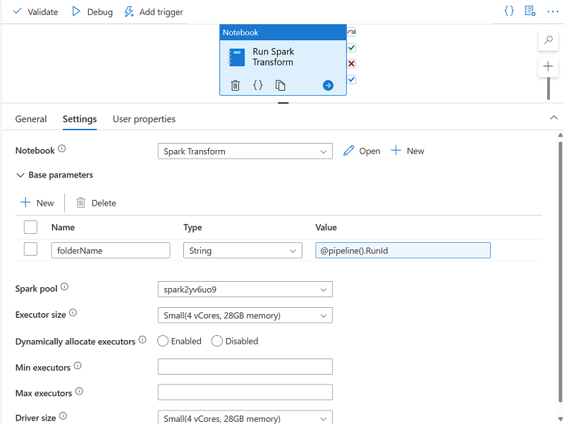

---
lab:
  title: パイプラインで Apache Spark ノートブックを使用する
  ilt-use: Lab
---

# パイプラインで Apache Spark ノートブックを使用する

この演習では、Apache Spark ノートブックを実行するアクティビティを含む Azure Synapse Analytics パイプラインを作成します。

この演習の所要時間は約 **30** 分です。

## 開始する前に

管理レベルのアクセス権を持つ [Azure サブスクリプション](https://azure.microsoft.com/free)が必要です。

## Azure Synapse Analytics ワークスペースをプロビジョニングする

データ レイク ストレージと Spark プールにアクセスできる Azure Synapse Analytics ワークスペースが必要です。

この演習では、Azure Synapse Analytics ワークスペースをプロビジョニングするために、PowerShell スクリプトと ARM テンプレートを組み合わせて使用します。

1. [Azure portal](https://portal.azure.com) (`https://portal.azure.com`) にサインインします。
2. ページ上部の検索バーの右側にある **[\>_]** ボタンを使用して、Azure portal に新しい Cloud Shell を作成します。メッセージが表示された場合は、***PowerShell*** 環境を選択して、ストレージを作成します。 次に示すように、Azure portal の下部にあるペインに、Cloud Shell のコマンド ライン インターフェイスが表示されます。

    

    > **注**: 前に *Bash* 環境を使ってクラウド シェルを作成している場合は、そのクラウド シェル ペインの左上にあるドロップダウン メニューを使って、***PowerShell*** に変更します。

3. ペインの上部にある区分線をドラッグして Cloud Shell のサイズを変更でき、ペインの右上にある —、 **&#9723;** 、**X** のアイコンを使用してペインを最小化、最大化、または閉じることができます。 Azure Cloud Shell の使い方について詳しくは、[Azure Cloud Shell のドキュメント](https://docs.microsoft.com/azure/cloud-shell/overview)をご覧ください。

4. PowerShell のペインで、次のコマンドを入力して、このリポジトリを複製します。

    ```powershell
    rm -r dp-203 -f
    git clone https://github.com/MicrosoftLearning/dp-203-azure-data-engineer dp-203
    ```

5. リポジトリが複製されたら、次のコマンドを入力してこの演習用のフォルダーに変更し、そこに含まれている **setup.ps1** スクリプトを実行します。

    ```powershell
    cd dp-203/Allfiles/labs/11
    ./setup.ps1
    ```
    
6. メッセージが表示された場合は、使用するサブスクリプションを選択します (これは、複数の Azure サブスクリプションへのアクセス権を持っている場合にのみ行います)。
7. メッセージが表示されたら、Azure Synapse SQL プールに設定する適切なパスワードを入力します。

    > **注**: このパスワードは忘れないようにしてください。

8. スクリプトの完了まで待ちます。通常、約 10 分かかりますが、さらに時間がかかる場合もあります。 待っている間に、Azure Synapse Analytics ドキュメントの [Azure Synapse Pipelines](https://learn.microsoft.com/en-us/azure/data-factory/concepts-data-flow-performance-pipelines) に関する記事を確認してください。

## Spark ノートブックを対話的に実行する

ノートブックを使用してデータ変換プロセスを自動化する前に、ノートブックを対話形式で実行すると、後で自動化するプロセスをより深く理解するのに役立つ可能性があります。

1. スクリプトが完了したら、Azure portal で、作成された dp203-xxxxxxx リソース グループに移動し、ご自分の Synapse ワークスペースを選択します。
2. Synapse ワークスペースの **[概要]** ページの **[Synapse Studio を開く]** カードで **[開く]** を選択し、新しいブラウザー タブで Synapse Studio を開きます。ダイアログが表示された場合はサインインします。
3. Synapse Studio の左側にある [››] アイコンを使用してメニューを展開します。ここから、Synapse Studio 内にさまざまなページを表示します。
4. **[データ]** ページで [リンク] タブを表示し、**synapsexxxxxxx (Primary - datalakexxxxxxx)** のような名前の Azure Data Lake Storage Gen2 ストレージ アカウントへのリンクがワークスペースに含まれていることを確認します。
5. ストレージ アカウントを展開して、そこに **files (primary)** という名前のファイル システム コンテナーが含まれていることを確認します。
6. files コンテナーを選択し、**data** という名前のフォルダーが含まれることに注目します。この中にあるデータ ファイルを変換します。
7. **data**** フォルダーを開き、その中にある CSV ファイルを表示します。 任意のファイルを右クリックし、 **[プレビュー]** を選択して、データのサンプルを表示します。 終わったら、プレビュー ウィンドウを閉じます。
8. いずれかのファイルを右クリックし、 **[プレビュー]** を選択して、そこに含まれているデータを表示します。 このファイルにはヘッダー行が含まれているため、列ヘッダーを表示するには、オプションを選択できることに注意してください。
9. プレビューを閉じます。 次に、[Allfiles/labs/11/notebooks](https://github.com/MicrosoftLearning/dp-203-azure-data-engineer/tree/master/Allfiles/labs/11/notebooks) から **Spark Transform.ipynb** をダウンロードします

    > **注**: ***Ctrl + A*** キー、***Ctrl + C*** キーの順に押してこのテキストをコピーし、***Ctrl + V*** を使ってメモ帳などのツールに貼り付け、ファイルを使い、ファイルの種類を***すべてのファイル***にして **Spark Transform.ipynb** という名前で保存します。 GitHub 内でファイルを選び、次に省略記号 (...) を選んでから **[ダウンロード]** を選び、覚えやすい場所に保存することもできます。 
    

10 次に、**[開発]** ページで **[ノートブック]** を展開し、[+ インポート] オプションの ![[Spark ノートブックのインポート]](./images/spark-notebook-import.png) をクリックします
    
        
1. 先ほどダウンロードし、**Spark Transfrom.ipynb** という名前で保存したファイルを選びます。
2. ノートブックを **spark*xxxxxxx*** Spark プールにアタッチします。
3. ノートブックの注意事項を確認して、コード セルを実行します。

    > **注**: Spark プールを開始する必要があるため、最初のコード セルの実行には数分かかります。 後続のセルは、もっと速く実行されます。
4. このノートブックに含まれるコードを確認し、次の点に注意します。
    - 一意のフォルダー名を定義する変数を設定します。
    - **/data** フォルダーから CSV 販売注文データを読み込みます。
    - 顧客名を複数のフィールドに分割してデータを変換します。
    - 変換されたデータを名前が一意のフォルダーに Parquet 形式で保存します。
5. ノートブックのツール バーで、**ノートブックを spark*xxxxxxx*** Spark プールにアタッチし、 **[&#9655; すべて実行]** ボタンを使用してノートブック内のすべてのコード セルを実行します。
  
    Spark セッションが開始され、コード セルが実行できるようになるまで数分かかる場合があります。

6. すべてのノートブック セルが実行されたら、変換されたデータが保存されているフォルダーの名前をメモします。
7. **files** タブ (まだ開いているはずです) に切り替え、ルートの **files** フォルダーを表示します。 必要に応じて、 **[その他]** メニューで **[更新]** を選択して新しいフォルダーを表示します。 次に、それを開いて、Parquet ファイルがあることを確認します。
8. ルートの **files** フォルダーに戻り、ノートブックによって生成された名前が一意のフォルダーを選択し、 **[新しい SQL スクリプト]** メニューで **[上位 100 行を選択]** を選択します。
9. **[上位 100 行を選択]** ペインで、ファイルの種類を **[Parquet 形式]** に設定し、変更を適用します。
10. 新しい SQL スクリプト ペインが開くので、 **[&#9655;実行]** ボタンを使用して SQL コードを実行し、変換された販売注文データが返されることを確認します。

## パイプラインでノートブックを実行する

これで変換プロセスを理解し、パイプラインにノートブックをカプセル化して自動化する準備ができました。

### パラメーター セルを作成する

1. Synapse Studio で、ノートブックが含まれる **Spark 変換** のタブに戻り、ツール バーの右端にある **[...]** メニューで **[出力のクリア]** を選択します。
2. 最初のコード セル (**folderName** 変数を設定するコードが含まれる) を選択します。
3. コード セルの右上にあるポップアップ ツール バーの **[...]** メニューで、 **[\[@] パラメーター セルの切り替え]** を選択します。 セルの右下に単語**パラメーター**が表示されていることを確認します。
4. ツール バーで、 **[発行]** ボタンを使用して変更を保存します。

### パイプラインを作成する

1. Synapse Studio で、 **[統合]** ページを選択します。 次に、 **+** メニューで、 **[パイプライン]** を選択して新しいパイプラインを作成します。
2. 新しいパイプラインの **[プロパティ]** ペインで、その名前を「**Pipeline1**」から「**販売データの変換**」に変更します。 次に、 **[プロパティ]** ペインの上にある **[プロパティ]** ボタンを使用して、それを非表示にします。
3. **[アクティビティ]** ペインで、 **[Synapse]** を展開し、次に示すように、**Notebook** アクティビティをパイプライン設計画面にドラッグします。

    

4. 
5. Notebook アクティビティの **[全般]** タブで、その名前を「**Spark 変換の実行**」に変更します。
6. Notebook アクティビティの **[設定]** タブで、次のプロパティを設定します。
    - **Notebook**: 「**Spark 変換**」ノートブックを選択します。
    - **基本パラメーター**: このセクションを展開し、次の設定を指定してパラメーターを定義します。
        - **名前**: folderName
        - **種類**:文字列型
        - **値**: **[動的コンテンツの追加]** を選択し、パラメーター値を "パイプライン実行 ID" システム変数 (`@pipeline().RunId`) に設定します**
    - **Spark プール**: **spark*xxxxxxx*** プールを選択します。
    - **Executor のサイズ**: **[小 (4 仮想コア、28 GB メモリ)]** を選択します。

    パイプライン ペインが次のように表示されます。

    

### パイプラインを発行して実行する

1. **[すべて発行]** ボタンを使用して、パイプライン (およびその他の未保存の資産) を発行します。
2. パイプライン デザイナー ペインの上部にある **[トリガーの追加]** メニューで、 **[今すぐトリガー]** を選択します。 次に、 **[OK]** を選択して、パイプラインの実行を確定します。

    **注**: スケジュールされた時刻または特定のイベントに応答してパイプラインを実行するトリガーを作成することもできます。

3. パイプラインの実行が開始されたら、 **[監視]** ページで **[パイプラインの実行]** タブを表示し、「**販売データの変換**」パイプラインの状態を確認します。
4. 「**販売データの変換**」パイプラインを選択してその詳細を表示し、 **[アクティビティの実行]** ペインのパイプライン実行 ID をメモします。

    パイプラインの完了には 5 分以上かかる場合があります。 ツール バーの **&#8635; [最新の情報に更新]** ボタンを使用して、その状態を確認できます。

5. パイプライン実行が成功したら、 **[データ]** ページで **files** ストレージ コンテナーを参照し、パイプライン実行 ID の名前が付いた新しいフォルダーが作成されていること、変換された販売データ用の Parquet ファイルがあることを確認します。
   
## Azure リソースを削除する

Azure Synapse Analytics を調べ終わったら、不要な Azure コストを避けるために、作成したリソースを削除する必要があります。

1. Synapse Studio ブラウザー タブを閉じ、Azure portal に戻ります。
2. Azure portal の **[ホーム]** ページで、**[リソース グループ]** を選択します。
3. Synapse Analytics ワークスペースに対して **dp203-*xxxxxxx*** リソース グループ (管理対象リソース グループ以外) を選択し、そこに Synapse ワークスペース、ストレージ アカウント、ワークスペースの Spark プールが含まれていることを確認します。
4. リソース グループの **[概要]** ページの上部で、**[リソース グループの削除]** を選択します。
5. リソース グループ名として「**dp203-*xxxxxxx***」と入力し、これが削除対象であることを確認したら、 **[削除]** を選択します。

    数分後に、Azure Synapse ワークスペース リソース グループと、それに関連付けられているマネージド ワークスペース リソース グループが削除されます。
