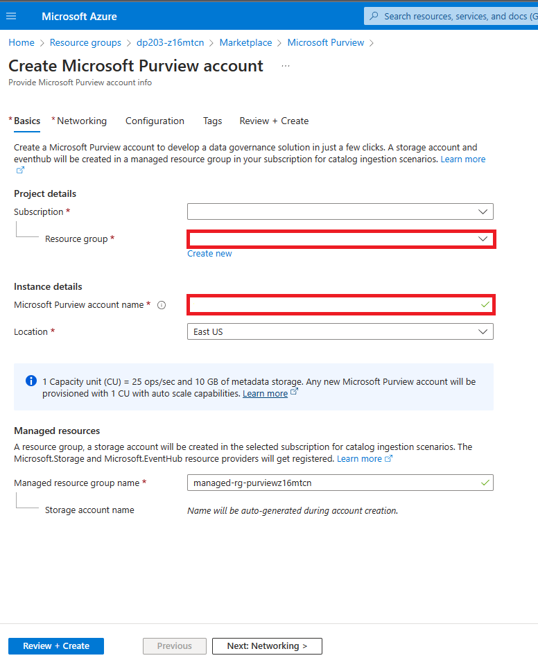
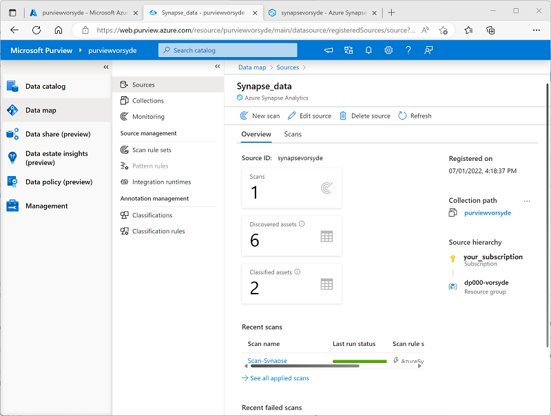

---
lab:
  title: Azure Synapse Analytics で Microsoft Purview を使用する
  ilt-use: Lab
---

# Azure Synapse Analytics で Microsoft Purview を使用する

Microsoft Purview を使用すると、データ エステート全体でデータ資産をカタログ化し、データ ソース間で転送されるデータのフローを追跡できます。これは、包括的なデータ ガバナンス ソリューションの重要な要素です。

この演習の所要時間は約 **40** 分です。

## 開始する前に

管理レベルのアクセス権を持つ [Azure サブスクリプション](https://azure.microsoft.com/free)が必要です。

## Azure リソースをプロビジョニングする

この演習では、Microsoft Purview を使用して、Azure Synapse Analytics ワークスペースの資産とデータ系列を追跡します。 まず、スクリプトを使用して Azure サブスクリプションでこれらのリソースをプロビジョニングします。

1. [Azure portal](https://portal.azure.com) (`https://portal.azure.com`) にサインインします。
2. ページ上部の検索バーの右側にある **[\>_]** ボタンを使用して、Azure portal に新しい Cloud Shell を作成します。メッセージが表示された場合は、***PowerShell*** 環境を選択して、ストレージを作成します。 次に示すように、Azure portal の下部にあるペインに、Cloud Shell のコマンド ライン インターフェイスが表示されます。

    

    > **注**: 前に *Bash* 環境を使ってクラウド シェルを作成している場合は、そのクラウド シェル ペインの左上にあるドロップダウン メニューを使って、***PowerShell*** に変更します。

3. ペインの上部にある区分線をドラッグして Cloud Shell のサイズを変更したり、ペインの右上にある **&#8212;** 、 **&#9723;** 、**X** アイコンを使用して、ペインを最小化または最大化したり、閉じたりすることができます。 Azure Cloud Shell の使い方について詳しくは、[Azure Cloud Shell のドキュメント](https://docs.microsoft.com/azure/cloud-shell/overview)をご覧ください。

4. PowerShell のペインで、次のコマンドを入力して、リポジトリを複製します。

    ```
    rm -r dp-203 -f
    git clone https://github.com/MicrosoftLearning/dp-203-azure-data-engineer dp-203
    ```

5. リポジトリが複製されたら、次のコマンドを入力してこのラボ用のフォルダーに変更し、そこに含まれている **setup.ps1** スクリプトを実行します。

    ```
    cd dp-203/Allfiles/labs/22
    ./setup.ps1
    ```

6. メッセージが表示された場合は、使用するサブスクリプションを選択します (これは、複数の Azure サブスクリプションへのアクセス権を持っている場合にのみ行います)。
7. メッセージが表示されたら、Azure SQL Database の適切なパスワードを入力します。

    > **注**: このパスワードは忘れないようにしてください。

8. スクリプトの完了まで待ちます。通常、約 15 分かかりますが、さらに時間がかかる場合もあります。 待っている間に、Microsoft Purview のドキュメントの記事「[Microsoft Purview ガバナンス ポータルで利用できる機能](https://docs.microsoft.com/azure/purview/overview)」を確認してください。

> **ヒント**: セットアップ スクリプトの実行後にラボを完了しないことに決めた場合は、不要な Azure コストを避けるために、ご自分の Azure サブスクリプション内に作成された **dp203-*xxxxxxx*** リソース グループを必ず削除してください。


## レイクデータベースを作成する

Lake データベースは、Azure Storage 上のデータ レイクにデータを保存します。Parquet、Delta、または CSV 形式とさまざまな設定を使用して、ストレージを最適化できます。各レイク データベースには、ルート データ フォルダーを定義するためのリンクされたサービスがあります。

Lake データベースは Synapse SQL サーバーレス SQL プールと Apache Spark でアクセスできるため、ユーザーはストレージをコンピューティングから分離できます。レイク データベースのメタデータにより、さまざまなエンジンが統合されたエクスペリエンスを提供し、データ レイクではサポートされていなかった追加情報 (関係など) を使用することが容易になります。

1. レイク データベースを作成するには、まず適切なリソース グループから synapsexxxxxxx を開いてから、**Open Synapse Studio** の ***open*** リンクをクリックします。
2. 次に、レンチが入っているツールボックスをクリックします。これは、Synapse Analytics ワークスペースの [Manage] セクションでもあり、専用プールが実行されていることを確認します。開始までに数分かかる場合があります。
4. [Data] パネルに入ったら、**データ** という単語の右側にある + 記号をクリックし、***Lake データベース*** を選択します。
   
    

> **注**: **Azure Synapse データベース テンプレートの使用条件**というプロンプトが表示されます。**OK** ボタンをクリックする前に、これを読んで理解する必要があります。

5. 一番右側に [プロパティ] ウィンドウがあることがわかります。
   1. 名前フィールドに「**lakedb**」と入力します。
   1. **入力フォルダー** でフォルダーを選択し、root/files/data を参照して、**OK** を押します。

>**注**: **入力フォルダー**を開くときにエラーが表示される可能性があります。その場合は、**OK**をクリックする前に、ルート フォルダーをダブルクリックしてデータまで作業を進めてください。

   1. この画面の左側に、**lakedb** の名前とその下に **+Table** が記載された柱が表示されます。これをクリックして、***データ レイクから*** を選択します。
   1. ***外部テーブル名*** の下に「**Products**」と入力します。
   1. ***リンクされたサービス*** で、デフォルトのオプションを選択します。
   1. ***入力ファイルまたはフォルダー*** 内で、右端のファイル フォルダーをクリックし、**root > files > data >** に移動し、***products.csv*** を選択して、クリックします。 **OK** をクリックし、**続行** をクリックします。

6. [**新しい外部テーブル**] ペインで、***列名を推測***するために [最初の行] オプションを選択し、**作成** をクリックします。


7. クエリ設計ウィンドウの上部にある [**発行**] を押します。
8. [**データ**] で、左側の [**ワークスペース**] 領域にいることを確認し、**Lake データベース** セクションを展開し、**lakedb** を展開してから、***マウスを展開します。 **Products**テーブルの右側***に移動し、***上位100行***を選択します。


> **注**: **接続先**が**組み込み**としてリストされていることを確認し、**master**データベースを選択したままにするか、右側の更新ボタンをクリックしてください。 **lakedb** データベースを選択します。[データベース].[スキーマ].[テーブル] の 3 つの部分からなる命名規則を使用しているため、どちらも機能します。


9. [**実行**] ボタンを押して、レイク データベース テーブル内のデータを表示します。

## Microsoft Purview サービスをアカウントに追加する

Microsoft Purview は、データ ガバナンス、情報保護、リスク管理、コンプライアンス ソリューションにわたる製品の包括的なポートフォリオです。オンプレミス、マルチクラウド、SaaS (Software as a Service) データにわたるデータ資産全体を管理、保護、管理するのに役立ちます。

これを設定するには、まずメイン リソース グループに戻ります。このグループには、割り当てられた乱数に基づいて dp203-xxxxxxx という名前が付けられます。**リソース グループ**内に入ったら、[***+作成***] ボタンをクリックして新しいサービスを追加します。

1. **Microsoft Purview サービス**を選択し、**作成** ボタンをクリックします。
2. 作成プロセスでは、適切なリソース グループで開始したため、すでに選択されているはずです。次に、ランダムに割り当てられた番号を使用して **Purview** に名前を付けます。次に、インスタンスに最適なリージョンを選択します。

   

3. [**レビューと作成**] ボタンをクリックし、次に進む前に ***検証*** を待ちます。

   

4. 検証に合格したら、**作成** ボタンを押します。

> **注意**: Purview での検証に合格するには、いくつかのリージョンを試す必要がある場合があります。

## Microsoft Purview で Azure Synapse Analytics データ資産をカタログ化する

Microsoft Purview を使用すると、Azure Synapse ワークスペース内のデータ ソースを含め、データ エステート全体でデータ資産をカタログ化できます。 スクリプトを使用してデプロイしたワークスペースには、データ レイク (Azure Data Lake Storage Gen2 アカウント内)、サーバーレス データベース、専用 SQL プール内のデータ ウェアハウスが含まれます。

### Microsoft Purview 向けにロールベースのアクセスを構成する

Microsoft Purview は、マネージド ID を使用するように構成されています。 データ資産をカタログ化するには、このマネージド ID アカウントから、Azure Synapse Analytics ワークスペースとそのデータ レイク ストアのストレージ アカウントにアクセスできる必要があります。

1. [Azure portal](https://portal.azure.com) で、セットアップ スクリプトによって作成された **dp203-*xxxxxxx*** リソース グループを参照し、作成されたリソースを表示します。 具体的な内容は次のとおりです。
    - 名前が **datalake*xxxxxxx*** のようなストレージ アカウント。
    - 名前が **purview*xxxxxxx*** のような Microsoft Purview アカウント。
    - 名前が **sql*xxxxxxx*** のような専用 SQL プール。
    - 名前が **synapse*xxxxxxx*** のような Synapse ワークスペース。
2. **datalake*xxxxxxx*** ストレージ アカウントを開き、その **[Access Control (IAM)]** ページで、次に示すように **[ロールの割り当て]** タブを表示します。

    ![ストレージ アカウントの [ロールの割り当て] タブのスクリーンショット。](./images/storage-roles.png)

3. **[+ 追加]** ボタン メニューで、 **[ロールの割り当ての追加]** を選択します。 
4. **[ロールの割り当ての追加]** ページの **[ロール]** タブで、"ストレージ BLOB" を検索し、 **[ストレージ BLOB データ閲覧者]** ロールを選択します。 **[次へ]** を選択して **[メンバー]** タブに移動します。

    ![[ロールの割り当ての追加] の [ロール] タブのスクリーンショット。](./images/storage-role-assignment.png)

5. **[メンバー]** タブの **[アクセスの割り当て先]** リストで、 **[マネージド ID]** を選択し、 **[メンバー]** の下で **[メンバーの選択]** を選択します。
6. **[マネージド ID の選択]** ペインの **[マネージド ID]** リストで **[Microsoft Purview アカウント (*n*)]** を選択し、ご自分の Microsoft Purview アカウント (**purview*xxxxxxx*** のような名前) を選択し、 **[選択]** ボタンを使用して、このアカウントをロールの割り当てに追加します。

    ![[マネージド ID の選択] タブのスクリーンショット。](./images/storage-role-members.png)

7. **[確認と割り当て]** ボタンを使用してロールの割り当てを完了することで、Microsoft Purview リソースのマネージド ID によって使用される **purview*xxxxxxx*** アカウントをご自分のストレージ アカウントの**ストレージ BLOB データ閲覧者**ロールのメンバーにします。
8. Azure portal で、**dp203-*xxxxxxx*** リソース グループに戻り、**synapse*xxxxxxx*** Synapse Analytics ワークスペースを開きます。 次に、その **[Access Control (IAM)]** ページで、ロールの割り当てを追加して **purview*xxxxxxx*** マネージド ID アカウントをワークスペースの**閲覧者**ロールのメンバーにします。

### Microsoft Purview のデータベースのアクセス許可を構成する

Azure Synapse Analytics ワークスペースには、"サーバーレス" と "専用" の両方の SQL プールにデータベースが含まれ、Microsoft Purview で使用されるマネージド ID にアクセスが必要です。** **

1. Azure portal で、Synapse Analytics ワークスペースのページで、 **[概要]** タブを表示します。次に、 **[Synapse Studio を開く]** タイルで、リンクを使用して、新しいブラウザー タブに Azure Synapse Studio を開きます。ダイアログが表示されたらサインインします。

    >**ヒント**: または、新しいブラウザー タブで、 https://web.azuresynapse.net を直接参照して Azure Synapse Studio を開くこともできます。

2. Synapse Studio の左側にある **&rsaquo;&rsaquo;** アイコンを使用してメニューを展開します。これにより、さまざまなページが Synapse Studio 内に表示されます。
3. **[管理]** ページの **[SQL プール]** タブで、専用 SQL プール **sql*xxxxxxx*** の行を選択し、 **&#9655;** アイコンを使用して起動します。メッセージが表示されたら、再開することを確認します。

    ![Synapse Studio の [SQL プール] ページのスクリーンショット。](./images/resume-sql-pool.png)

4. SQL プールが再開されるまで待ちます。 これには数分かかることがあります。 **[&#8635; 最新の情報に更新]** ボタンを使用して、その状態を定期的に確認できます。 準備ができると、状態が **[オンライン]** と表示されます。
5. Azure Synapse Studio で **[データ]** ページを表示し、 **[ワークスペース]** タブで **[SQL データベース]** を展開して、ワークスペース内のデータベースを表示します。 これらに、以下が含まれている必要があります。
    - **lakedb** という名前のサーバーレス SQL プール データベース。
    - **sql*xxxxxxx*** という名前の専用 SQL プール データベース。

    ![Synapse Studio の [データ] ページに 2 つの SQL データベースが一覧表示されているスクリーンショット。](./images/sql-databases.png)

6. **lakedb** データベースを選択し、その **[...]** メニューで **[新しい SQL スクリプト]**  >  **[空のスクリプト]** を選択して、新しい **[SQL スクリプト 1]** ペインを開きます。 ツール バーの右端にある **[プロパティ]** ボタン ( **&#128463;<sub>*</sub>** のような外観) を使用して **[プロパティ]** ペインを非表示にし、スクリプト ペインをより簡単に表示できます。
7. **[SQL スクリプト 1]** ペインで、次の SQL コードを入力し、***purviewxxxxxxx*** のすべてのインスタンスをご自分の Microsoft Purview アカウントのマネージド ID 名に置き換えます。

    ```sql
    CREATE LOGIN purviewxxxxxxx FROM EXTERNAL PROVIDER;
    GO

    CREATE USER purviewxxxxxxx FOR LOGIN purviewxxxxxxx;
    GO

    ALTER ROLE db_datareader ADD MEMBER purviewxxxxxxx;
    GO
    ```

8. **[&#9655; 実行]** ボタンを使用してスクリプトを実行すると、サーバーレス プールにログインが作成され、Microsoft Purview によって使用されるマネージド ID の **lakedb** ユーザーにユーザーが作成され、そのユーザーが **lakedb** データベースの **db_datareader** ロールに追加されます。
9. **sql*xxxxxxx*** 専用 SQL プール データベースに新しい空のスクリプトを作成し、それを使用して次の SQL コードを実行する (***purviewxxxxxxx*** をご自分の Microsoft Purview アカウントのマネージド ID 名に置き換えます) と、Microsoft Purview によって使用されるマネージド ID の専用 SQL プールにユーザーが作成され、**sql*xxxxxxx*** データベースの **db_datareader** ロールに追加されます。

    ```sql
    CREATE USER purviewxxxxxxx FROM EXTERNAL PROVIDER;
    GO

    EXEC sp_addrolemember 'db_datareader', purviewxxxxxxx;
    GO
    ```

### Microsoft Purview カタログにソースを登録する

これで Azure Synapse Analytics ワークスペースで使用されるデータ ソースをスキャンするために Microsoft Purview に必要なアクセスを構成したので、それらを Microsoft Purview カタログに登録できます。

1. Azure portal を開いているブラウザー タブに戻り、**dp203-*xxxxxxx*** リソース グループのページを表示します。
2. **purview*xxxxxxx*** Microsoft Purview アカウントを開き、その **[概要]** ページで、リンクを使用して、新しいブラウザー タブで **Microsoft Purview ガバナンス ポータル**を開きます。ダイアログが表示されたらサインインします。

    >**ヒント**: または、新しいブラウザー タブで https://web.purview.azure.com を直接参照することもできます。

3. Azure Purview ガバナンス ポータルの左側にある **&rsaquo;[&rsaquo;]** アイコンを使用してメニューを展開します。ここから、ポータル内にさまざまなページを表示します。
4. **[データ マップ]** ページの **[ソース]** サブページで、 **[登録]** を選択します。

    ![Microsoft Purview ガバナンス ポータルの [データ マップ] ページのスクリーンショット。](./images/purview-register.png)

5. **[ソースの登録]** タブが表示されるので、 **[Azure Synapse Analytics]** を選択して、次の設定でソースの登録を続けます。
    - **名前**: Synapse_data
    - **Azure サブスクリプション**: "使用する Azure サブスクリプションを選択します"**
    - **ワークスペース名**: "ご自分の **synapsexxxxxxx** ワークスペースを選択します"**
    - **専用 SQL エンドポイント**: sql*xxxxxxx*.sql.azuresynapse.net
    - **サーバーレス SQL エンドポイント**: sql*xxxxxxx*-ondemand.sql.azuresynapse.net
    - **コレクションを選択**: ルート (purview*xxxxxxx*)

    このデータ ソースに、ご自分の Azure Synapse Analytics ワークスペースの SQL データベースが含まれます。

6. **Synapse_data** ソースを登録したら、もう一度 **[登録]** を選択し、ご自分の Azure Synapse ワークスペースで使用されるデータ レイク ストレージに対して 2 つ目のソースを登録します。 **Azure Data Lake Storage Gen2** を選択し、次の設定を指定します。
    - **名前**: Data_lake
    - **Azure サブスクリプション**: "使用する Azure サブスクリプションを選択します"**
    - **ワークスペース名**: "ご自分の **datalakexxxxxxx** ストレージ アカウントを選択します"**
    - **エンドポイント**: https://datalakexxxxxxx.dfs.core.windows.net/
    - **コレクションを選択**: ルート (purview*xxxxxxx*)
    - **データ使用管理**: 無効

    **Synapse_data** と **Data_lake** の両方のソースを登録すると、次に示すように、データ マップの **purview*xxxxxx*** ルート コレクションの下に両方表示されるようになります。

    

### 登録済みソースをスキャンする

1. データ マップの **Synapse_data** ソースで、 **[詳細の表示]** を選択します。ソースにカタログ化された資産がないことを確認します。 ソースをスキャンして、その中に含まれるデータ資産を見つける必要があります。
2. **Synapse_data** 詳細ページで、 **[新しいスキャン]** を選択し、次の設定でスキャンを構成します。
    - **名前**: Scan-Synapse
    - **統合ランタイムへの接続**: Azure AutoresolveIntegrationRuntime
    - **種類**: SQL Database
    - **資格情報**: Microsoft Purview MSI (システム)
    - **SQL Database**: "**sqlxxxxxxx** 専用データベースと **lakedb** サーバーレス データベースの<u>両方</u>を選択します。"**
    - **コレクションを選択**: ルート (purview*xxxxxxx*)

    ![[新しいスキャン] ペインのスクリーンショット。](./images/purview-scan.png)

3. **[スキャン ルール セットの選択]** ページに進み、既定の **AzureSynapseSQL** ルール セットを選択する必要があります。
4. **[スキャン トリガーの設定]** ページに進み、 **[1 回のみ]** を選択してスキャンを 1 回のみ実行します。
4. **[スキャンの確認]** ページに進み、スキャンを保存して実行します。
6. **Synapse_data** スキャンの実行中に、 **[ソース]** ページに戻ってデータ マップを表示し、**Data_lake** ソースで **[新しいスキャン]** アイコンを使用して、次の設定でデータ レイクのスキャンを開始します。
    - **名前**: Scan-Data-Lake
    - **統合ランタイムへの接続**: Azure AutoresolveIntegrationRuntime
    - **資格情報**: Microsoft Purview MSI (システム)
    - **コレクションを選択**: ルート (purview*xxxxxxx*)
    - **スキャンのスコープ設定**: "**Data_lake** とすべてのサブ資産を選択します"** 
    - **スキャン ルール セットの選択**: AdlsGen2
    - **スキャン トリガーの設定**: 1 回のみ
    - **スキャンの確認** 保存および実行
7. 両方のスキャンが完了するまで待ちます。これには数分かかる場合があります。 次に示すように、各ソースの詳細ページを表示して、 **[最終実行状態]** を確認できます ( **[&#8635; 更新]** ボタンを使用して状態を更新できます)。 **[監視]** ページを表示することもできます (ただし、スキャンがここに表示されるまでに時間がかかる場合があります)。

    

### スキャンした資産を表示する

1. **[データ カタログ]** ページの **[参照]** サブページで、**purview*xxxxxxx*** コレクションを選択します。 ここで、Azure Synapse Analytics ワークスペース、データ レイクの Azure Storage アカウント、Azure Synapse Analytics の 2 つの SQL プール データベース、各データベースの **dbo** スキーマ、データベースのテーブルとビュー、データ レイクのフォルダーとファイルなど、Azure Synapse ワークスペースでカタログ化されたデータ資産とデータ レイク ストレージを表示できます。
2. 結果をフィルター処理するには、オブジェクトの種類の **[結果の絞り込みに使用]** リストで、 **[ファイル]** と **[テーブル]** を選択して、スキャンによってカタログ化されたファイル、テーブル、ビューのみが一覧表示されるようにします。

    

    データ資産に次のものが含まれることに注目します。

    - **products** - 製品データ用の専用 SQL プール内のテーブル。
    - **products.csv** - データ レイク内のファイル。
    - **products_csv** - *products.csv* ファイルから製品データを読み取るサーバーレス SQL プール内のビュー。

3. 見つかった資産を選択し、そのプロパティとスキーマを表示して調べます。 資産のプロパティ (個々のフィールドを含む) を編集して、メタデータ、分類、主題の専門家の連絡先の詳細、その他の役立つ詳細を追加して、データ アナリストが Microsoft Purview データ カタログでデータ エステートのデータ資産に関する多くの情報を見つけられるようにできます。

ここまで、Microsoft Purview を使用して、ご自分の Azure Synapse Analytics ワークスペース内のデータ資産をカタログ化しました。 Microsoft Purview カタログに複数の種類のデータ ソースを登録でき、データ資産の中央の統合ビューを作成できます。

次に、Azure Synapse Analytics と Microsoft Purview を統合する他の方法についていくつか説明します。

## Microsoft Purview を Azure Synapse Analytics と統合する

Azure Synapse Analytics では、Microsoft Purview との統合がサポートされており、データ資産を検出可能にし、ソース間で転送されるデータを転送するインジェスト パイプラインを通じてデータ系列を追跡できます。

### Azure Synapse Analytics で Microsoft Purview 統合を有効にする

1. Synapse Studio を開いているブラウザー タブに戻り、 **[管理]** ページで **[Microsoft Purview]** タブを選択し、 **[Purview アカウントに接続]** ボタンを使用して、サブスクリプション内の **purview*xxxxxxx*** アカウントをワークスペースに接続します。
2. アカウントを接続したら、 **[Purview アカウント]** タブを表示して、アカウントが **[データ系列 - Synapse パイプライン]** の状態が **[接続済み]** になっていることを確認します。

    

### Synapse Studio で Purview カタログを検索する

Microsoft Purview アカウントを Azure Synapse Analytics ワークスペースに接続したので、Synapse Studio からカタログを検索して、データ エステート全体でデータ資産を検出できるようになりました。

1. Synapse Studio で、 **[統合]** ページを表示します。
2. 次に示すように、ページの上部にある **[検索]** ボックスを使用して、**Purview** ソースで "products" という用語を検索します。

    

3. 結果で、**products.csv** を選択して、Purview カタログから詳細を表示します。

Purview カタログを Synapse Studio インターフェイスに統合することで、データ アナリストとエンジニアは、(Azure Synapse Studio ワークスペース内だけでなく) データ エステート全体から登録済みのデータ資産を見つけて調べることができます。

### パイプラインを作成して実行する

**lakedb** データベースの **products_csv** ビューは、製品データを含むデータ レイク内のテキスト ファイルに基づいています。 **sql*xxxxxxx*** 専用 SQL データベースの **products** テーブルは、現在空です。 Synapse パイプラインを使用して、データ レイクからテーブルにデータを読み込みましょう。

1. Synapse Studio の **[統合]** ページで、 **[+]** メニューの **[データ コピー ツール]** を選択します。
2. [データ コピー ツール] で、 **[組み込みのコピー タスク]** を選択し、 **[今すぐ実行]** を選択し、 **[次へ]** を選択します。
3. **[ソース データ ストア]** ページの **[接続]** リストで、**synapse*xxxxxxx*-WorkspaceDefaultStorage** 接続 (ワークスペースのデータ レイクを参照) を選択し、 **[ファイルまたはフォルダー]** で **files/products/products.csv** ファイルを参照します。 **[次へ]** を選択します。
4. **[ファイル形式の設定]** ページで、 **[テキスト形式の検出]** を選択します。 次の設定を確実に指定してから、 **[次へ]** を選択します。
    - **ファイル形式**: DelimitedText
    - **列区切り記号**: コンマ (,)
    - **行区切り記号**: 改行 (\n)
    - **最初の行をヘッダーとして使用**: 選択
    - **圧縮の種類**: なし
5. **[コピー先データ ストア]** ページの **[接続]** リストで、**sql*xxxxxxx*** (専用 SQL プールへの接続) を選択します。 次に、ターゲットを既存の **dbo.products** テーブルに設定し、 **[次へ]** を選択します。
6. **[列マッピング]** ページで、既定の列マッピングを確認し、 **[次へ]** を選択します。
7. **[設定]** ページで、 **[タスク名]** を **Load_Product_Data** に設定します。 次に、 **[一括挿入]** コピー メソッドを選択し、 **[次へ]** を選択します。
8. **[概要]** ページで、**[次へ]** を選びます。
9. パイプラインがデプロイされるまで待ってから、 **[完了]** を選択します。
10. Synapse Studio で、 **[監視]** ページを表示します。 次に、 **[パイプライン実行]** タブで、**Load_Product_Data** パイプラインの状態を確認します。 状態が **[成功]** に変わるまで数分かかる場合があります。
11. パイプライン実行が正常に完了したら、その名前 (**Load_Product_Data**) を選択して、パイプライン内のアクティビティの詳細を表示します。パイプラインに **Copy_* xxx** *のような自動的に派生した名前を持つ**データのコピー** タスクが含まれていることを確認します。このアクティビティで、データ レイク内のテキスト ファイルから **sql*xxxxxxx*** データベースの **products** テーブルにデータがコピーされました。

### Microsoft Purview でデータ系列を表示する

Synapse パイプラインを使用してデータベースにデータを読み込みました。 このアクティビティが Microsoft Purview で追跡されていることを確認しましょう。

1. Microsoft Purview ガバナンス ポータルを開いているブラウザー タブに切り替えます。
2. **[データ カタログ]** ページの **[参照]** サブページで、**purview*xxxxxxx*** コレクションを選択します。
3. 資産をフィルター処理して、**データ パイプライン**、**ファイル**、**テーブル**のみを表示します。 資産のリストに、**products.csv** ファイル、**Copy_*xxx*** * パイプライン アクティビティ、**products** テーブルが含まれるはずです。
4. **Copy_*xxx*** 資産を選択して、その詳細を表示し、 **[更新時刻]** に最近のパイプライン実行が反映されていることに注目します。
5. **Copy_*xxx*** 資産の **[系列]** タブで、**products.csv** ファイルから **products** テーブルへのデータ フローを示す図を表示します。

    ![[系列] タブのパイプライン資産にソースとターゲットが表示されているスクリーンショット。](./images/purview-lineage.png)

6. **Copy_*xxx*** 系列図で、**products.csv** ファイルを選択し、その **[資産に切り替え]** リンクを使用してソース ファイルの詳細を表示します。
7. **products.csv** 系列図で、**products** テーブルを選択し、その **[資産に切り替え]** リンクを使用してテーブルの詳細を表示します (テーブルの系列図を表示するには、 **[&#8635; 更新]** ボタンの使用が必要な場合があります)。

Azure Synapse Analytics を Microsoft Purview と統合することで有効になる系列追跡機能を使用すると、データ ストア内のデータがいつ、どのように読み込まれたか、どこにあったのかを特定できます。

> **ヒント**: この演習では、Microsoft Purview ガバナンス ポータルで系列情報を表示しましたが、同じ資産を検索統合機能を使用して Synapse Studio で表示することもできます。

### 専用 SQL プールを一時停止する

1. Synapse Studio のタブに戻り、 **[管理]** ページで **sql*xxxxxxx*** 専用 SQL プールを一時停止します。

## Azure リソースを削除する

Azure Synapse Analytics を調べ終わったら、不要な Azure コストを避けるために、作成したリソースを削除する必要があります。

1. Synapse Studio ブラウザー タブを閉じ、Azure portal に戻ります。
2. Azure portal の **[ホーム]** ページで、**[リソース グループ]** を選択します。
3. Synapse Analytics ワークスペースに対して **dp203-*xxxxxxx*** リソース グループ (管理対象リソース グループ以外) を選択し、そこに Synapse ワークスペース、ストレージ アカウント、ワークスペースの専用 SQL プールが含まれていることを確認します。
4. リソース グループの **[概要]** ページの上部で、**[リソース グループの削除]** を選択します。
5. リソース グループ名として「**dp203-*xxxxxxx***」と入力し、これが削除対象であることを確認したら、 **[削除]** を選択します。

    数分後に、Azure Synapse ワークスペース リソース グループと、それに関連付けられているマネージド ワークスペース リソース グループが削除されます。
